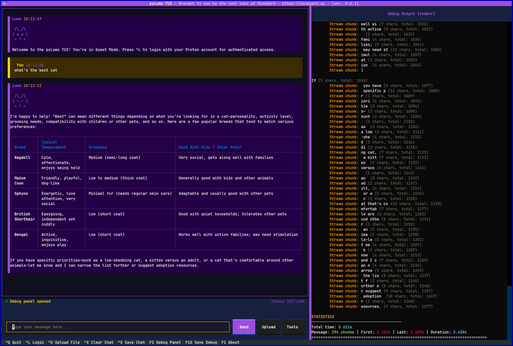

# pyLumo

<p align="center">
  
</p>

A Python client and terminal UI for the [Proton Lumo](https://lumo.proton.me) AI assistant with end-to-end encryption. A blogpost about the pyLumo project can be found [here](https://mindgard.ai/blog/understanding-lumo-ai-assistant-announcing-pylumo).

## Table of Contents

- [Features](#features)
- [Installation](#installation)
  - [Quick Install (Recommended)](#quick-install-recommended)
  - [Using uv](#using-uv)
- [Quick Start](#quick-start)
  - [Terminal UI](#terminal-ui)
  - [Command Line](#command-line)
- [Python API](#python-api)
- [Testing](#testing)
- [Uninstall](#uninstall)
- [Security](#security)
- [License](#license)
- [Links](#links)

## Features

- **End-to-end encryption** using AES-256-GCM + PGP hybrid encryption
- **Terminal UI (TUI)** with rich markdown rendering and inline images
- **CLI interface** for scripting and automation
- **Proton authentication** with secure session storage in system keychain
- **Guest mode** for unauthenticated access
- **Tool support**: web search, weather, stocks, cryptocurrency

## Installation

**Requirements:** Python 3.12+, GnuPG

### Quick Install (Recommended)

Clone the repository and use the Makefile:

```bash
git clone git@github.com:Mindgard/pylumo.git
cd pylumo

# Install with TUI support (recommended)
make install-tui

# Or CLI only
make install
```

The installer automatically handles all dependencies including the Proton Python client.

Note: Proton account authentication depends on Proton's `proton-python-client`. It is intentionally installed via `scripts/install.py` (rather than as a normal python dependency) due to upstream build issues. The installer pins a specific git ref and prints the exact commit hash that was installed (currently `0.7.1`).

### Using uv

If you prefer to use [uv](https://github.com/astral-sh/uv) directly:

```bash
# Create virtual environment
uv venv --python 3.12
source .venv/bin/activate

# Install (recommended): installs pylumo and a patched proton-python-client
# required for Proton authentication. The installer prints the pinned ref and
# installed commit hash.
python3 scripts/install.py --tui
```

## Quick Start

### Terminal UI

<p align="center">
  
</p>

```bash
# run via uv
uv run pylumo-tui

# or run from the project venv created by `make install-*`
./.venv/bin/pylumo-tui

# r activate the venv and run normally
source .venv/bin/activate
pylumo-tui
```

**Keyboard shortcuts:**
| Key | Action |
|-----|--------|
| `^L` | Login to Proton |
| `^K` | Logout |
| `^S` | Save chat |
| `^U` | Upload file |
| `^X` | Clear chat |
| `F1` | About |
| `F2` | Toggle debug panel |
| `F10` | Save debug output |
| `^\` | Command palette |
| `^Q` | Quit |

### Command Line

```bash
# Simple query (guest mode)
uv run pylumo "What is the capital of France?"

# With file upload
uv run pylumo -u document.pdf "Summarize this document"

# Pipe input
echo "Explain quantum computing" | uv run pylumo

# Save output to file
uv run pylumo -o response.txt "Write a haiku about coding"

# Use tools (e.g., cryptocurrency prices)
uv run pylumo "What is the current price of POPCAT?" --tools cryptocurrency
```

If you've activated the venv (`source .venv/bin/activate`), you can also run
`pylumo` and `pylumo-tui` directly without `uv run`.

**CLI Options:**
```
pylumo [PROMPT] [OPTIONS]

Arguments:
  PROMPT                  The prompt to send (before options, or via stdin)

Options:
  --tools TOOL [TOOL ...] Enable tools: proton_info, web_search, weather, stock, cryptocurrency
  --targets TARGET [...]  Response targets (default: title, message)
  -q, --quiet             Quiet mode (raw output only)
  -d, --debug             Debug mode (HTTP debugging)
  -o, --output FILE       Save output to file
  -u, --upload FILE       Upload a file with the request
```

## Python API

```python
from pylumo import pyLumo, LumoTools

# Guest mode (no authentication)
client = pyLumo()
response = client.send_request("Hello, Lumo!")
print(response["message"])

# Authenticated mode
client = pyLumo()
client.authenticate_with_proton("user@proton.me", "password")
client.save_session("~/.pylumo_session.json")

# With tools enabled
response = client.send_request(
    "What's the weather in London?",
    tools=[LumoTools.WEATHER, LumoTools.WEB_SEARCH]
)
```

## Testing

```bash
# Install development dependencies (includes pytest + pytest-cov)
uv pip install -e ".[dev]"

# Run tests
uv run pytest tests/

# Run tests with coverage
uv run pytest tests/ --cov=pylumo
```

See [docs/TESTING.md](docs/TESTING.md) for more.

## Uninstall

```bash
make uninstall
```

This removes `pylumo` and the Proton client dependency from the active Python
environment used by the uninstall script.

If you installed into the project venv (`./.venv`), you can also remove it
entirely with:

```bash
rm -rf .venv
```

## Security

- Session tokens are stored in system keychain (macOS Keychain, Linux Secret Service, Windows Credential Locker)
- TLS certificate pinning enabled by default (see note below)
- All communication encrypted with AES-256-GCM
- No sensitive data written to plain files

### Message integrity failures

- Streaming responses are authenticated with AES-GCM.
- If integrity verification fails (e.g., invalid tag/ciphertext), pyLumo treats this as an integrity error: it stops processing further chunks and returns an explicit error.

### Local data storage

- App-owned directories are created with owner-only permissions (`0700`).
- On-disk state files (e.g., config/session pointer files) are written atomically and forced to `0600` where supported.
- Proton session tokens are stored in the OS keychain; the on-disk session file is a non-secret pointer.

### What “end-to-end encryption” means here

- Prompts and conversation turns are encrypted client-side with AES-256-GCM using a fresh per-request key.
- The per-request AES key is encrypted to Proton/Lumo’s published PGP public key and sent alongside the request.
- This protects prompt/response content against passive network observers and intermediaries; it does not protect against a compromised endpoint (your machine) or against the service itself once it decrypts.

**Note:** The official [proton-python-client](https://github.com/ProtonMail/proton-python-client) module that pyLumo uses to authenticate to Proton's API only includes TLS pins for VPN endpoints. pyLumo [patches in the required pins](https://github.com/Mindgard/pylumo/blob/main/src/pylumo/pylumo.py#L33-L48) for `account.proton.me` at runtime to enable authentication with TLS pinning.

## License

GPL-3.0-or-later

## Links

- [Blogpost - Understanding Lumo AI Assistant: Announcing pyLumo](http://mindgard.ai/blog/understanding-lumo-ai-assistant-announcing-pylumo)
- [Proton Lumo](https://lumo.proton.me)
- [GitHub Repository](https://github.com/Mindgard/pylumo)
- [Mindgard](https://mindgard.ai)
